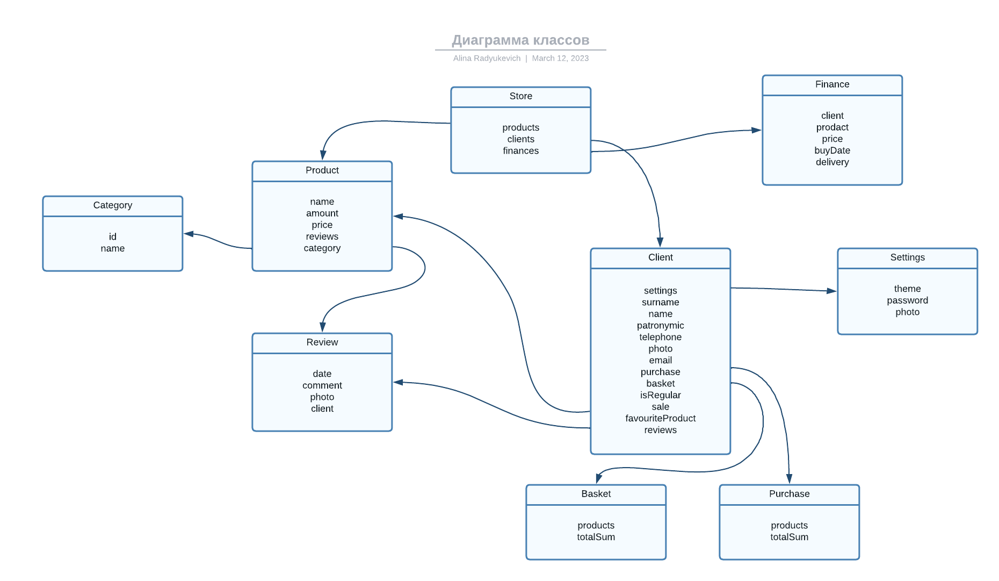

# Интернет-магазин
## _Радюкевич Алина, гр. 153502_
## 1. Описание предметной области
На Интернет-сайте представлены (выставлены на продажу) некоторые товары. Каждый из них имеет некоторое название, цену и единицу измерения (штуки, килограммы, литры). Проводится отслеживание финансовой состовляющей интернет-магазина.

Для проведения исследований и оптимизации работы магазина записываются стандартные данные клиента, а также телефон и адес электорнной почты для связи. В случае приобретения товаров на сумму свыше 5.000.000 рублей клиент переходит в категорию постоянных и получает скидку на каждую покупку в размере 2%. По каждому факту продажи автоматически фиксируется клиент, купленные товары, их количество, дата продажи и дата доставки.

## 2. Диаграмма классов

## 3. Описание функциональности приложения
### Функциональность клиента
- Создать аккаунт
- Удалить аккаунт
- Положить товар в корзину
- Удалить товар из корзины
- Купить товар
- Изменить настройки (пароль, аддресс и т.д.)
- Просмотреть список товаров магазина
### Функциональность владельца
- Просмотреть доход
- Просмотреть историю заказов
- Посмотреть наличие продуктов
## 4. Описание моделей данных
```Модель клиента``` - представляет собой пользователя веб-сайта. Включает в себя такие свойства, как имя клиента, телефон, купленные продукты и другие.

```Модель продукта``` - представляет собой товар и включает такие свойства, как название, количество, цена и другие.

```Модель финансов``` - представляет собой отчет о купленном товаре. Включает имя клиента, купившего товар, дату покупки, дату доставки и т.п.

```Модель отзыва``` - предствляет собой отзыв клиента. Включает в себя имя клиента, оставившего отзыв, фото, описание товара и поставленный товару рейтинг.
